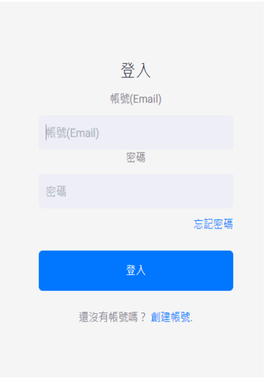
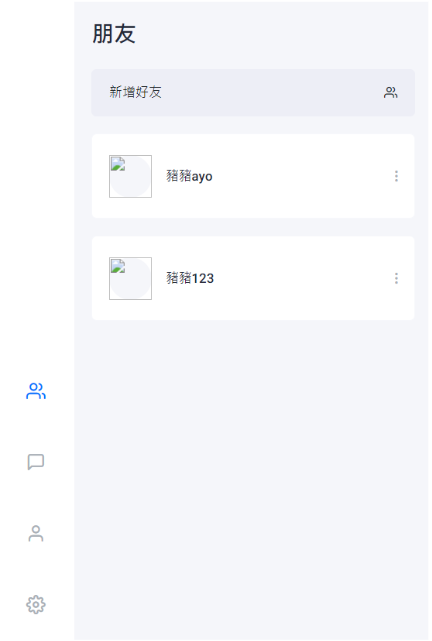
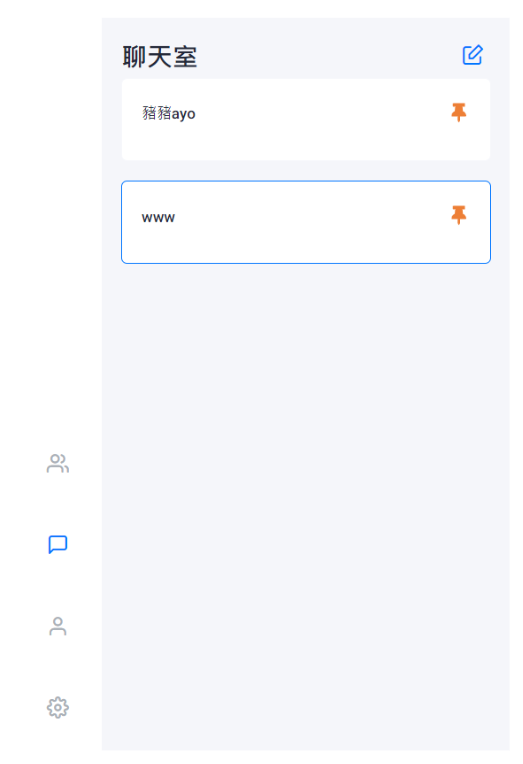
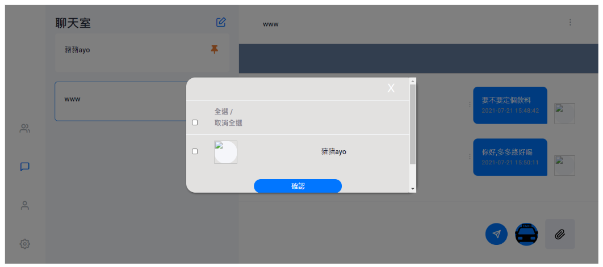
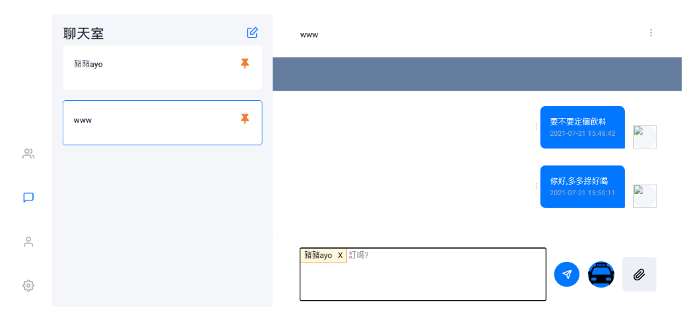
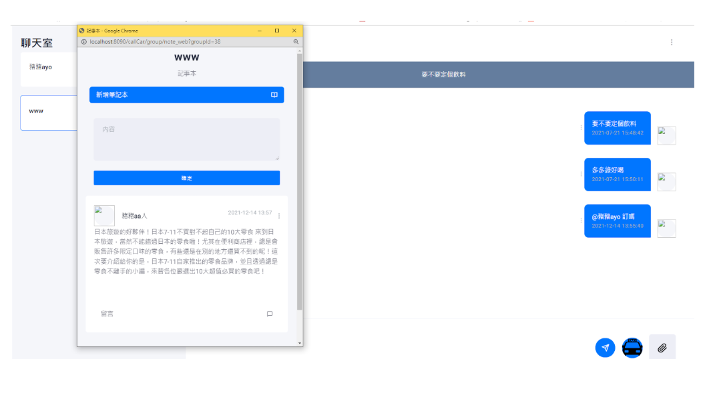
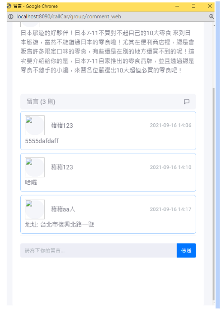

#  聊天系統
本專案為一款派即時聊天應用的後端服務，支援Web使用，提供用戶註冊、登入、好友管理、即時訊息傳遞、記事本及留言等功能。

---

## **🚀 功能特色**
✅ **用戶註冊與登入驗證**   
✅ **好友邀請與管理** :   
✅ **即時訊息傳遞（支援文字與圖片）**  
✅ **聊天室建立與管理**  
✅ **訊息歷史記錄查詢,支援分頁Loading**  
✅ **記事本及留言**
---

## **⚙️ 技術組合**
✅ **後端**：Java + SpringMvc 框架  
✅ **資料庫**：MySql
✅ **即時通訊**：WebSocket  
✅ **前端Web** : JSP、JS、Bootstrap RWD 套版、Ajax、JQuery

---
## **Demo截圖**

